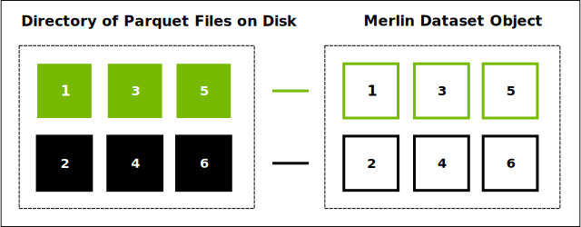
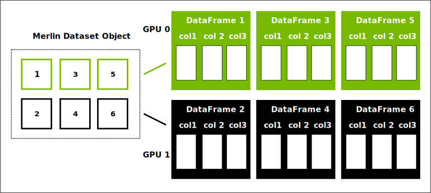

# About the Merlin Dataset

```{contents}
---
depth: 2
local: true
backlinks: none
---
```

## On-disk Representation

The Apache Parquet file format is the most-frequently used file format for Merlin datasets.

Parquet is a columnar storage format.
The format arranges the values for each column in a long list.
This format is in contrast with a row-oriented format---such as a comma-separated values format---that arranges all the data for one row together.

As an analogy, columnar storage is like a dictionary of columns instead of row-oriented storage that is like a list of rows.

In most cases, a Parquet dataset includes multiple files in one or more directories.



The Merlin dataset class, `merlin.io.Dataset`, treats a collection of many Parquet files as a single dataset.
By treating the collection as a single dataset, Merlin simplifies distributing computation over multiple GPUs or multiple machines.

The dataset class is not a copy of the data or a modification of the Parquet files.
An instance of the class is similar to a collection of pointers to the Parquet files.

When you create an instance of the dataset class, Merlin attempts to infer a schema by reading one record of the data.
Merlin attempts to determine the column names and data types.

## Processing Data: Dataset and DataFrame

When you perform a computation on a Merlin dataset, the dataset reads from the files on disk and converts them into a set of DataFrames.
The DataFrames, like Parquet files, use a columnar storage format.
The API for a DataFrame is similar to a Python dictionary---you can reference a column with syntax like `dataframe['col1']`.



Merlin processes each DataFrame individually and aggregates the results across the DataFrames as needed.
There are two kinds of computations that you can perform on a dataset: `fit` and `transform`.

The `fit` computations perform a full pass over the dataset to compute statistics, find unique values, perform grouping, or another operation that requires information from multiple DataFrames.

The `transform` computations process each DataFrame individually.
These computations use the information gathered from `fit` to alter the DataFrame.
For example the `Normalize` and `Clip` Operators compute new values for columns and the `Rename` Operator adds and removes columns.

More information about the `fit` and `transform` methods is provided in [](./about-operators.md).

## Reference Documentation

- {py:class}`merlin.io.Dataset`
- {py:class}`nvtabular.ops.Normalize`
- {py:class}`nvtabular.ops.Clip`
- {py:class}`nvtabular.ops.Rename`