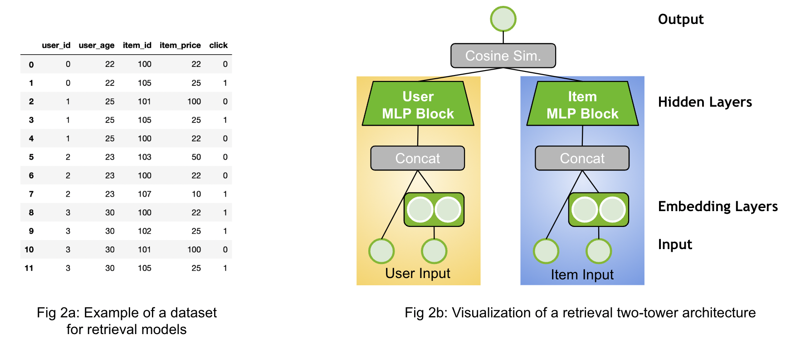
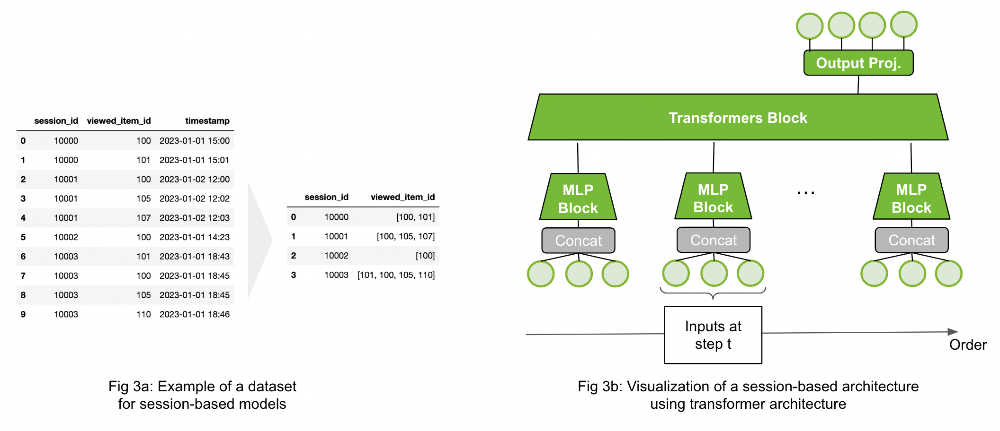

Recommender Models Guide
=====================

This guide explains the different type of recommender models with a focus on deep-learning based ones.

.. section-numbering::

A `recommender model` is a single model, e.g. rule-based or trained one, which outputs a score or set of candidates. Generating final recommendations often requires multiple steps, called `recommender systems`. There is more information on recommender systems in the next guide (will follow soon). 

Ranking Models
----------------------------------

.. image:: ./imgs/models_ranking.png

Ranking models are probably the most common use-case in recommender systems. When the community talks about recommender models, they probably mean ranking models. 

The ranking model predicts a specific target. For example, it could be the review a customer would give an item (regression, explicit feedback) or it could be the likelihood a user will click on an item (binary, implicit feedback). Click-through-rate prediction use-case is a typical example for that. The Figure 1a above provides a simple example of a dataset for the binary classification case. The dataset has different input features (`user_id`, `user_age`, etc.) and the target (`click`). The dataset contains both the positive (`click=1`) and negative (`click=0`) interaction data. If negative examples are not available, then negative sampling strategies are required. An example architecture is visualized by Figure 1b. The inputs are concatenated and fed through an Multi-Layer Perceptron (MLP) Block (multiple fully connected layers).

Merlin Models provides implementation of popular architectures, such as MLP, NCF, Facebook’s DLRM, Google’s DCN and Google’s Wide&Deep networks with TensorFlow backend. Classical machine learning models, such as implicit or XGBoost can be used in Merlin Models, as well.

**Resources**:
- [Exploring Different Models](https://github.com/NVIDIA-Merlin/models/blob/main/examples/03-Exploring-different-models.ipynb) demonstrates how to build and train the popular deep learning architectures with **Merlin Models in TensorFlow** on an example dataset.
- [Getting Started Guide - Ranking Models](https://github.com/NVIDIA-Merlin/Merlin/tree/main/examples/quick_start) provides a detailed view on applying the ranking models to a dataset and how to use it for a new dataset.
- [Serving Ranking Models](https://github.com/NVIDIA-Merlin/systems/blob/main/examples/Serving-Ranking-Models-With-Merlin-Systems.ipynb) is a simple example how to deploy a ranking model with Merlin Systems and Triton in TensorFlow
- [Getting Started Movielesn](https://github.com/NVIDIA-Merlin/Merlin/tree/main/examples/getting-started-movielens) is one end-to-end example for feature engineering, training and deployment with different frameworks (TensorFlow, PyTorch and HugeCTR) on a small scale.
- [Scaling Criteo](https://github.com/NVIDIA-Merlin/Merlin/tree/main/examples/scaling-criteo) is similar to the MovieLens example, but on a large scale of ~4 billion rows. It provides some guidance on multi-GPU scaling.

Retrieval Models
----------------------------------

Sequential and Session-Based Models
----------------------------------

