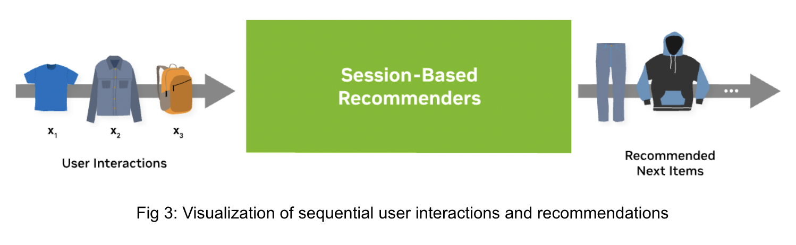

Recommender Models Guide
=====================

This guide explains the different type of recommender models with a focus on deep-learning based ones.

.. contents:: Table of Contents
   :depth: 1
   :local:
   :backlinks: none

A ``recommender model`` is a single model, e.g. rule-based or trained one, which outputs a score or set of candidates. Generating final recommendations often requires multiple steps, called ``recommender systems``. There is more information on recommender systems in the next guide (will follow soon). 

Ranking Models
-------------

.. image:: ./imgs/models_ranking.png

**Ranking models** are probably the most common use-case in recommender systems. When the community talks about recommender models, they probably mean ranking models. 

The ranking model predicts a specific target. For example, it could be the review a customer would give an item or it could be the likelihood a user will click on an item. Click-through-rate prediction is a typical use-case for that. The Figure 1a above provides a simple example of a dataset. The dataset has different input features (``user_id``, ``user_age``, etc.) and the target (``click``). The dataset contains both the positive (``click=1``) and negative (``click=0``) interaction data. If negative examples are not available, then negative sampling strategies are required. An example architecture is visualized by Figure 1b. The inputs are concatenated and fed through an Multi-Layer Perceptron (MLP) Block (multiple fully connected layers).

Merlin Models provides implementation of popular architectures, such as MLP, NCF, Facebook’s DLRM, Google’s DCN and Google’s Wide&Deep networks with TensorFlow backend. Classical machine learning models, such as implicit or XGBoost can be used in Merlin Models, as well.

**Resources**:

* `Exploring Different Models <https://github.com/NVIDIA-Merlin/models/blob/main/examples/03-Exploring-different-models.ipynb>`_ demonstrates how to build and train the popular deep learning architectures with **Merlin Models in TensorFlow** on an example dataset.
* `Getting Started Guide - Ranking Models <https://github.com/NVIDIA-Merlin/Merlin/tree/main/examples/quick_start>`_ provides a detailed view on applying the ranking models to a dataset and how to use it for a new dataset.
* `Serving Ranking Models <https://github.com/NVIDIA-Merlin/systems/blob/main/examples/Serving-Ranking-Models-With-Merlin-Systems.ipynb>`_ is a simple example how to deploy a ranking model with Merlin Systems and Triton in TensorFlow.
* `Getting Started Guide - Ranking Models <https://github.com/NVIDIA-Merlin/Merlin/tree/main/examples/quick_start>`_ provides a detailed view on applying the ranking models to a dataset and how to use it for a new dataset.
* `Getting Started Movielens <https://github.com/NVIDIA-Merlin/Merlin/tree/main/examples/quick_start>`_ is one end-to-end example for feature engineering, training and deployment with different frameworks (TensorFlow, PyTorch and HugeCTR) on a small scale.
* `Scaling Criteo <https://github.com/NVIDIA-Merlin/Merlin/tree/main/examples/scaling-criteo>`_ is similar to the MovieLens example, but on a large scale of ~4 billion rows. It provides some guidance on multi-GPU scaling.

Retrieval Models
-------------

.. image:: ./imgs/models_retrieval.png

The goal of **retrieval models** are to retrieve hundreds of candidates from large item catalogs. In order to be scalable, they have a special neural network architecture: It usually processes the input data into two fully separated towers as visualized above Figure 2b. 

One tower is the user tower (query tower, yellow) and one tower is the item tower (candidate tower, blue). The input features for each tower are only relevant to their context. The user tower has access only to the user features and the item tower has access only to the item features. The output of the towers are the user embedding (user representation) and item embedding (item representation). At the last step, we calculate the final score by applying the dot-product (cosine similarity) of the two embedding vectors.

The advantage of retrieval models is that the user and item features interact only at the last step. In the deployment stage, the item embeddings can be pre-computed and stored in an Approximate Nearest Neighbor (ANN) index. A recommendation request can be served by calculating the user embedding and then retrieving the TopK items from the ANN index. This can significantly reduce latency, infrastructure cost and improve throughput.

The dataset for retrieval models (Figure 2a) looks similar than in the ranking use-case with multiple user and item features. It is important to separate the features into user and item feature as input to the model. Similar than ranking models, retrieval models can be trained with negative sampling strategies when there are no negatives provided in the dataset.

Merlin Models provides implementations for Matrix Factorization (MF) and Two-Tower architectures. 

**Resources**:

* `Retrieval Models <https://github.com/NVIDIA-Merlin/models/blob/main/examples/05-Retrieval-Model.ipynb>`_ is an example to build matrix factorization and two-tower models using negative sampling with **Merlin Models in TensorFlow**.
* `Scale faster with less code using Two Tower with Merlin <https://medium.com/nvidia-merlin/scale-faster-with-less-code-using-two-tower-with-merlin-c16f32aafa9f?source=friends_link&sk=be70da36948c883b4f15a745470146ee>`_ is our blog post providing more details on Two-Tower models.
* `Solving the Cold-Start Problem using Two-Tower Neural Networks for NVIDIA’s E-Mail Recommender Systems <https://medium.com/nvidia-merlin/solving-the-cold-start-problem-using-two-tower-neural-networks-for-nvidias-e-mail-recommender-2d5b30a071a4?source=friends_link&sk=b06b93495fa017162875a8917e3aa975>`_ is our blog post sharing our experience in applying Two-Tower models to our e-mail use case.

Sequential and Session-Based Models
-------------

Users often interact with items in a sequential order (see Figure 3). One way to use the sequential nature in ranking or retrieval models is to sort the training data and train the models without shuffling the data. In that way the model was updated with the latest information per user. However, there will be a delay between retraining a model and receiving new information from a user.

.. image:: ./imgs/models_sessionbased.png

Another approach is to define a neural network architecture, which leverages the sequential information as an input for sequential and session-based models. **Session-based models** are the special type of sequential models, where we use the sequence of each user session (in an online system) as input data and try to predict the next item/content the user will interact with.

The advantage is that the model can recommend items based on the most recent user information. The latest user interactions should provide information about his/her current intent. Anonymous and new users can be personalized given his/her user history of the current session without retraining the model.

The dataset for sequential and session-based models contains a grouping column (e.g. ``session_id``), order column (e.g. ``timestamp``) and interaction column (e.g. ``viewed_item_id``) as visualized in Figure 4a left. The dataset will be transformed by sorting the dataset by the `timestamp` and group it by ``session_id``. As a result, the dataset contains per ``session_id`` the sorted interactions (``viewed_item_id``) as a list. The goal is to predict the next item given an input sequence.

There are multiple options to process sequence inputs. The domain has similarities with natural language processing (NLP) and many techniques can be used for training a sequential recommender model. Popular choices are RNN-based (GRU or LSTM) or transformer-based architectures. The Figure 4b above visualized a transformer-based session-based model. If the dataset contains othersequential input features (side information) in addition to the item-ids, they can be processed by a MLP Block before applying a Transformer Block. Models can be trained with casual language modeling (CLM) or masked language modeling (MLM). Session-based models can be used for retrieval or ranking problems.

**Merlin Models** provides high-quality implementation for RNN-based and Transformer-based architectures (backed by HuggingFace) with different sampling strategies in **TensorFlow**. **Transformers4Rec** provides similar functionality for **PyTorch**. GRU4Rec, LSTM4Rec, GPT, BERT, Transformer-XL, XLNet or ELECTRA based sequence blocks can be used with Merlin.

**Resources:**

* `Transformer-based architecture for next-item prediction task <https://github.com/NVIDIA-Merlin/models/blob/main/examples/usecases/transformers-next-item-prediction.ipynb>`_ provides an introduction to train transformer-based architecture and deploy them with **Merlin Models in TensorFlow**.
* `Session-Based Next Item Prediction for Fashion E-Commerce <https://github.com/NVIDIA-Merlin/models/blob/main/examples/usecases/ecommerce-session-based-next-item-prediction-for-fashion.ipynb>`_ is a detailed session-based example from MLP and Bi-LSTM to transformer-based architectures with **Merlin Models in TensorFlow**.
* `Getting Started: Session-based Recommendation with Synthetic Data <https://github.com/NVIDIA-Merlin/Transformers4Rec/tree/main/examples/getting-started-session-based>`_ is a getting example for session-based, transformer-based models with **Transformers4Rec in PyTorch**.
* `End-to-end session-based recommendation <https://github.com/NVIDIA-Merlin/Transformers4Rec/tree/main/examples/end-to-end-session-based>`_ is an example using a public available dataset for session-based, transformer-based models with **Transformers4Rec in PyTorch**.
* `Transformers4Rec: A flexible library for Sequential and Session-based recommendation <https://medium.com/nvidia-merlin/transformers4rec-4523cc7d8fa8?source=friends_link&sk=390245e60c10211c381f7a26ce12cfc6>`_ is a blog post summarizing our research paper with **Transformers4Rec**.
