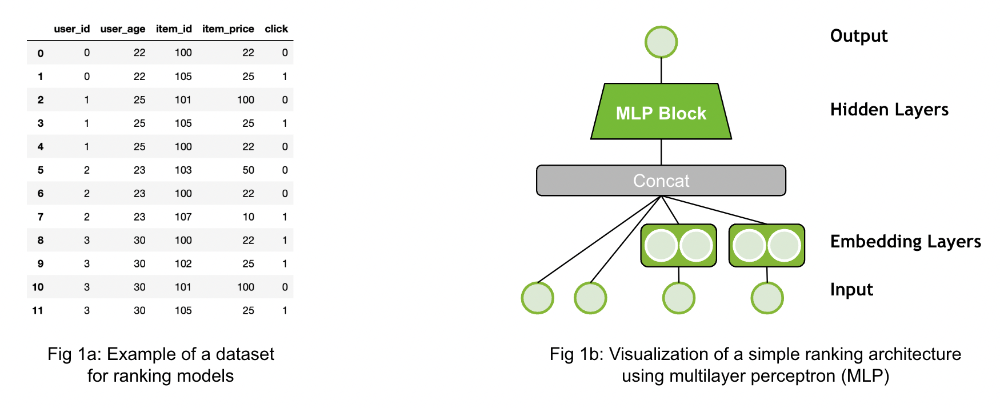

Recommender Models Guide
=====================

This guide explains the different type of recommender models with a focus on deep-learning based ones.

.. section-numbering::

A `recommender model` is a single model, e.g. rule-based or trained one, which outputs a score or set of candidates. Generating final recommendations often requires multiple steps, called `recommender systems`. There is more information on recommender systems in the next guide (will follow soon). 

Ranking Models
----------------------------------

Ranking models are probably the most common use-case in recommender systems. When the community talks about recommender models, they probably mean ranking models. 

The ranking model predicts a specific target. For example, it could be the review a customer would give an item (regression, explicit feedback) or it could be the likelihood a user will click on an item (binary, implicit feedback). Click-through-rate prediction use-case is a typical example for that. The Figure 1a above provides a simple example of a dataset for the binary classification case. The dataset has different input features (`user_id`, `user_age`, etc.) and the target (`click`). The dataset contains both the positive (`click=1`) and negative (`click=0`) interaction data. If negative examples are not available, then negative sampling strategies are required. An example architecture is visualized by Figure 1b. The inputs are concatenated and fed through an Multi-Layer Perceptron (MLP) Block (multiple fully connected layers).

Merlin Models provides implementation of popular architectures, such as MLP, NCF, Facebook’s DLRM, Google’s DCN and Google’s Wide&Deep networks with TensorFlow backend. Classical machine learning models, such as implicit or XGBoost can be used in Merlin Models, as well.

**Resources**:
- [Exploring Different Models](https://github.com/NVIDIA-Merlin/models/blob/main/examples/03-Exploring-different-models.ipynb) demonstrates how to build and train the popular deep learning architectures with **Merlin Models in TensorFlow** on an example dataset.
- [Getting Started Guide - Ranking Models](https://github.com/NVIDIA-Merlin/Merlin/tree/main/examples/quick_start) provides a detailed view on applying the ranking models to a dataset and how to use it for a new dataset.
- [Serving Ranking Models](https://github.com/NVIDIA-Merlin/systems/blob/main/examples/Serving-Ranking-Models-With-Merlin-Systems.ipynb) is a simple example how to deploy a ranking model with Merlin Systems and Triton in TensorFlow
- [Getting Started Movielesn](https://github.com/NVIDIA-Merlin/Merlin/tree/main/examples/getting-started-movielens) is one end-to-end example for feature engineering, training and deployment with different frameworks (TensorFlow, PyTorch and HugeCTR) on a small scale.
- [Scaling Criteo](https://github.com/NVIDIA-Merlin/Merlin/tree/main/examples/scaling-criteo) is similar to the MovieLens example, but on a large scale of ~4 billion rows. It provides some guidance on multi-GPU scaling.

Retrieval Models
----------------------------------

.. image:: ./imgs/models_retrieval.png

The goal of retrieval models are to retrieve hundreds of candidates from large item catalogs. In order to be scalable, they have a special neural network architecture: It usually processes the input data into two fully separated towers as visualized above Figure 2b: One tower is the user tower (query tower, yellow) and one tower is the item tower (candidate tower, blue). The input features for each tower are only relevant to their context. The user tower has access only to the user features (e.g `user_id`, `user_age)` and the item tower has access only to the item features (e.g. `item_id`, `item_price`).The output of the towers are the user embedding (user representation) and item embedding (item representation). At the last step, we calculate the final score by applying the dot-product (cosine similarity) of the two embedding vectors.

The advantage of retrieval models is that the user and item features interact only at the last step. In the deployment stage, the item embeddings can be pre-computed and stored in an Approximate Nearest Neighbor (ANN) index. A recommendation request can be served by calculating the user embedding and then retrieving the TopK items from the ANN index. This can significantly reduce latency, infrastructure cost and improve throughput.

The dataset for retrieval models (Figure 2a) looks similar than in the ranking use-case with multiple user and item features. It is important to separate the features into user and item feature as input to the model. Similar than ranking models, retrieval models can be trained with negative sampling strategies when there are no negatives provided in the dataset.

Merlin Models provides implementations for Matrix Factorization (MF) and Two-Tower Architectures. 

Resources:
- [Retrieval Models](https://github.com/NVIDIA-Merlin/models/blob/main/examples/05-Retrieval-Model.ipynb) is an example to build matrix factorization and two-tower models using negative sampling with Merlin Models in TensorFlow.
- [Scale faster with less code using Two Tower with Merlin](https://medium.com/nvidia-merlin/scale-faster-with-less-code-using-two-tower-with-merlin-c16f32aafa9f?source=friends_link&sk=be70da36948c883b4f15a745470146ee) is our blog post providing more details on Two-Tower models.
- [Solving the Cold-Start Problem using Two-Tower Neural Networks for NVIDIA’s E-Mail Recommender Systems](https://medium.com/nvidia-merlin/solving-the-cold-start-problem-using-two-tower-neural-networks-for-nvidias-e-mail-recommender-2d5b30a071a4?source=friends_link&sk=b06b93495fa017162875a8917e3aa975) is our blog post sharing our experience in applying Two-Tower models to our e-mail use case.

Sequential and Session-Based Models
----------------------------------

.. image:: ./imgs/models_sessionbased.png