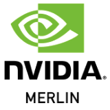
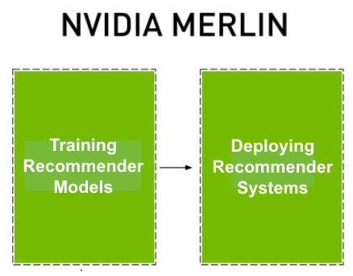
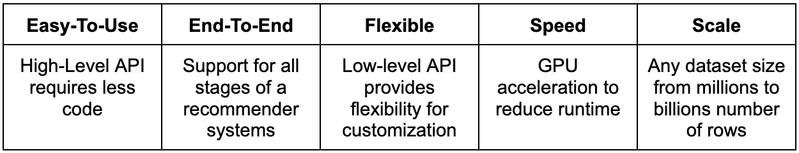
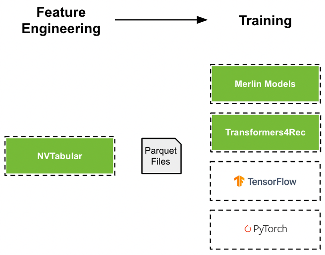
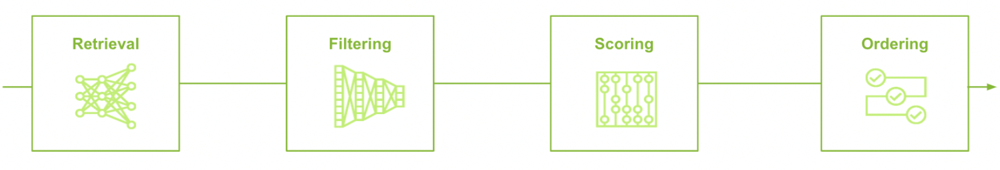

*****************
Introduction
*****************

NVIDIA Merlin™ is an open-source framework for building high-performing recommender systems at any scale. It is designed to be interoperable within existing recommender workflows and supports the entire recommender pipeline - training recommender models and deploying recommender systems. Single or multiple NVIDIA Merlin components can be used to build recommender pipelines. NVIDIA Merlin supports GPU and CPU. 

Benefits of NVIDIA Merlin
=====================

NVIDIA Merlin provides a high-level API to define complex recommender system pipelines with only a few lines of code. The API can be used to define each step from feature engineering to training to deployment (inference). The low-level API provides flexibility for customization. Each stage can be GPU-accelerated to reduce runtime. The system is designed to maximize GPU-utilization. At inference, throughput or latency is optimized. The frameworks support any scale of dataset from only 1 millions rows (few Gigabytes) to 100s of billions of rows (multiple Terabytes). 

NVIDIA Merlin is an open source framework, containing a collection of individual libraries. Each library can be used standalone and a user can select one or multiple libraries to build a recommender system. 

Training Recommender Models
=====================

A Recommender model is a single model which outputs a score or set of candidates. Training a recommender model requires processing the input dataset and training a machine learning model. NVIDIA Merlin supports many options to train recommender models for either (applied) research or industry use-cases.

Feature Engineering
-------------

`NVTabular <https://nvidia-merlin.github.io/NVTabular/stable/Introduction.html>`_ is a library for feature engineering and preprocessing the dataset. It provides implementation of common techniques (e.g. Normalization) and more advanced ones. It scales to a dataset larger than (GPU) memory by streaming the dataset in chunks.

Training
-------------

NVIDIA Merlin has multiple options to train a recommender model to provide flexibility to the user and address the complex and diverse techniques in the community.

`Merlin Models <https://nvidia-merlin.github.io/models/stable/README.html>`_ provides high-quality implementations for classical machine learning models and deep learning based models using **TensorFlow** as a backend. It provides implementations for **ranking, retrieval and session-based models (GRU or transformer-based)** with a standardized API.

`Transformers4Rec <https://nvidia-merlin.github.io/Transformers4Rec/stable/README.html>`_ is a library for **session-based recommendation with deep learning models (Transformers, RNNs)** using **PyTorch** as a backend. It provides implementations for transformer-based architectures. 

Native **TensorFlow** or **PyTorch** can be used to define and train deep learning based models.

Deploying Recommender Systems
=====================

Recommender models are often one component in a pipeline with multiple stages. Generating recommendations often requires multiple steps. For example, out-of-stock items should be removed from the recommendations. 

`Merlin Systems <https://nvidia-merlin.github.io/systems/stable/README.html>`_  is a tool to build pipelines for generating recommendations. Its API enables users to define complex multi-stage pipelines, by combining single components (e.g. trained model) or connecting to additional services (e.g. feature store, ANN). Merlin systems can produce recommendations offline as batch jobs or deploy the pipeline to Triton Inference Server for online predictions.

NVIDIA Triton Inference Server is an open source solution to scale, run and deploy machine learning and AI models from any framework on any GPU- or CPU-based infrastructure. It is used by many companies in production.
