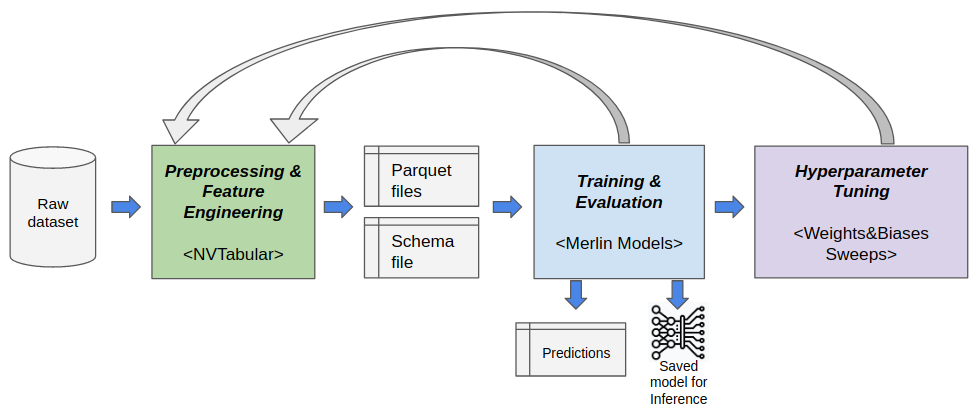

# Quick-start for ranking models with Merlin
**Do you want to get the best possible accuracy for your ranking problem?**
**This guide will teach you best practices on preprocessing data, training and hypertuning ranking models with Merlin.**

We iterate in this guide over a typical Data Science process which involves data preprocessing / feature engineering, model training and evaluation and hyperparameter tuning.
<center>

</center>

We use as example here the [TenRec dataset](https://static.qblv.qq.com/qblv/h5/algo-frontend/tenrec_dataset.html), which is large (140 million positive interactions from 5 million users), contains explicit negative feedback (items exposed to the user and not interacted) and multiple target columns (click, like, share, follow).

## Setup
You can run these scripts either using the latest Merlin TensorFlow image or installing the necessary Merlin libraries according to their documentation ([core](https://github.com/NVIDIA-Merlin/core), [NVTabular](https://github.com/NVIDIA-Merlin/NVTabular), [dataloader](https://github.com/NVIDIA-Merlin/dataloader), [models](https://github.com/NVIDIA-Merlin/models/)).  
In this doc we provide the commands for setting up a Docker container for Merlin TensorFlow, as it provides all necessary libraries already installed.

### Download the TenRec dataset
You can find the TenRec dataset in this [link](https://static.qblv.qq.com/qblv/h5/algo-frontend/tenrec_dataset.html). You might switch the page language to *English* in the top-right link, if you prefer.  
To be able to download the data, you need first to agree with the terms an register your e-mail. After downloading the zipped file (4.2 GB) you just need to uncompress the data.


## Preparing the data
The TenRec dataset contains a number of CSV files. We will be using the `QK-video.csv`, which logs user interactions with different videos.   

Here is an example on how the data looks like. For ranking models, you typically have user, item and contextual features and one or more targets, that can be a binary (e.g. has the customer clicked or liked and item) or regression target (e.g. watch times).


As `QK-video.csv` has a reasonable size (~15 GB with ~493 million examples), feel free to reduce it for less rows you want to test the pipeline more quickly or if you don't have a powerful GPU available (V100 with 32 GB or better). For example, with the following command you can truncate the file keeping the first 10 million rows (header line included).

```bash
head -n 10000001 QK-video.csv > QK-video-10M.csv
```

### Start Docker container

1. Pull the latest [Merlin TensorFlow image](https://catalog.ngc.nvidia.com/orgs/nvidia/teams/merlin/containers/merlin-tensorflow).  

```bash
docker pull nvcr.io/nvidia/merlin/merlin-tensorflow:latest 
```

2. Set `INPUT_DATA_PATH` variable to the folder where `QK-video.csv` was saved.  
The `OUTPUT_PATH` is the place where the preprocessed dataset and trained model will be saved.

```bash
INPUT_DATA_PATH=/path/to/input/dataset/
OUTPUT_PATH=/path/to/output/path/
```

3. Start a Merlin TensorFlow container in interactive mode
```bash
docker run --gpus all --rm -it --ipc=host -v $INPUT_DATA_PATH:/data -v $OUTPUT_PATH:/outputs \
  nvcr.io/nvidia/merlin/merlin-tensorflow:latest /bin/bash
```

4. Inside the container, go to `/Merlin/examples/quick_start` folder and install the Quick-start dependencies.
```bash
cd /Merlin/examples/quick_start
pip install -r requirements.txt
```


## Preprocessing

In order to make it easy getting the data ready for model training, we provide a generic script: [preprocessing.py](scripts/preproc/preprocessing.py). That script is based on **dask_cudf** and **NVTabular** libraries that leverage GPUs for accelerated and distributed preprocessing.  
P.s. **NVTabular** also supports CPU which is suitable for prototyping in dev environments.

The preprocessing script outputs preprocessed data as a number of parquet files, as well as a *schema* that stores output features metadata like statistics and tags.

In this example, we set some options for preprocessing. Here is the explanation of the main arguments; you can check the [full documentation and best practices for preprocessing](scripts/preproc/README.md).

- `--categorical_features` - Names of the categorical/discrete features (concatenated with "," without space).
- `--binary_classif_targets` - Names of the available target columns for binary classification task
- `--regression_targets` - Names of the available target columns for regression task
- `--user_id_feature` - Name of the user id feature
- `--item_id_feature` - Name of the item id feature
- `--to_int32`, `--to_int16`, `--to_int8` - Allows type casting the columns to the lower possible precision, which may avoid memory issues with large datasets.
- `--dataset_split_strategy` - Strategy for splitting train and eval sets. In this case, `random_by_user` is chosen, which means that train and test will have the same users with some random examples reserved for evaluation.
- `--random_split_eval_perc` - Percentage of data to reserve for eval set
- `--filter_query` - A filter query condition compatible with dask-cudf `DataFrame.query()`. In this example, we keep only examples were all targets are 0 or where click=1, to remove examples where we have other targets equals to 1, but click = 0.
- `--min_item_freq`, `--min_user_freq`, `max_user_freq` - Filters out training examples from users or items based on their min or max frequency threshold

For larger dataset (like the full TenRec dataset), in particular when using filtering options that require dask_cudf filtering (e.g. `--filter_query`, `--min_item_freq`) we recommend using the following options to avoid out-of-memory errors:
- `--enable_dask_cuda_cluster` - Initializes a dask-cudf `LocalCUDACluster` for managed single or multi-GPU preprocessing
- `--persist_intermediate_files` - Persists/caches to disk intermediate files during preprocessing (in paricular after filtering). 


```bash
cd /Merlin/examples/quick_start/scripts/preproc/
OUT_DATASET_PATH=/outputs/dataset
python preprocessing.py --input_data_format=csv --csv_na_values=\\N --data_path /data/QK-video.csv --filter_query="click==1 or (click==0 and follow==0 and like==0 and share==0)" --min_item_freq=30 --min_user_freq=30 --max_user_freq=150 --num_max_rounds_filtering=5 --enable_dask_cuda_cluster --persist_intermediate_files --output_path=$OUT_DATASET_PATH --categorical_features=user_id,item_id,video_category,gender,age --binary_classif_targets=click,follow,like,share --regression_targets=watching_times --to_int32=user_id,item_id --to_int16=watching_times --to_int8=gender,age,video_category,click,follow,like,share --user_id_feature=user_id --item_id_feature=item_id --dataset_split_strategy=random_by_user --random_split_eval_perc=0.2
```

After you execute this script, a folder `dataset` will be created in `--output_path` with the preprocessed datasets , with `train` and `eval` folders. You will find a number of partitioned parquet files inside those dataset folders, as well as a `schema.pbtxt` file produced by `NVTabular` which is very important for automated model building in the next step.

## Training a ranking model
Merlin Models is a Merlin library that makes it easy to build and train RecSys models. It is built on top of TensorFlow, and provides building blocks for creating input layers based on the features in the schema, different feature interaction layers and output layers based on the target columns defined in the schema.

A number of popular ranking models are available in Merlin Models API like **DLRM**, **DCN-v2**, **Wide&Deep**, **DeepFM**. This Quick-start provides a generic ranking script [ranking.py](scripts/ranking/ranking.py) for building and training those models using Models API.

 In the following command example, you can easily train the popular **DLRM** model which performs 2nd level feature interaction. It sets `--model dlrm` and `--embeddings_dim 64` because DLRM models require all categorical columns to be embedded with the same dimension for the feature interaction. You notice that we can set many of the common model (e.g. top `--mlp_layers`) and training hyperparameters like learning rate (`--lr`) and its decay (`--lr_decay_rate`, `--lr_decay_steps`), L2 regularization (`--l2_reg`, `embeddings_l2_reg`), `--dropout` among others.  We set `--epochs 1` and `--train_steps_per_epoch 10` to train for just 10 batches and make runtime faster. If you have a  GPU with more memory (e.g. V100 with 32 GB), you might increase `--train_batch_size` and `--eval_batch_size` to a much larger batch size, for example to `65536`.  
There are many target columns available in the dataset, and you can select one of them for training by setting `--tasks=click`. In this dataset, there are about 3.7 negative examples (`click=0`) for each positive example (`click=1`). That leads to some class unbalance. We can deal with that by setting `--stl_positive_class_weight` to give more weight to the loss for positive examples, which are rarer.


```bash
cd /Merlin/examples/quick_start/scripts/ranking/
OUT_DATASET_PATH=/outputs/dataset
CUDA_VISIBLE_DEVICES=0 TF_GPU_ALLOCATOR=cuda_malloc_async python  ranking.py --train_data_path $OUT_DATASET_PATH/train --eval_data_path $OUT_DATASET_PATH/eval --output_path ./outputs/ --tasks=click --stl_positive_class_weight 3 --model dlrm --embeddings_dim 64 --l2_reg 1e-4 --embeddings_l2_reg 1e-6 --dropout 0.05 --mlp_layers 64,32  --lr 1e-4 --lr_decay_rate 0.99 --lr_decay_steps 100 --train_batch_size 65536 --eval_batch_size 65536 --epochs 1 --train_steps_per_epoch 10 
```
You can explore the [full documentation and best practices for ranking models](scripts/ranking/README.md), which contains details about the command line arguments.

## Training a ranking model with multi-task learning
When multiple targets are available for the same features, models typically benefit from joint training a single model with multiple heads / losses. Merlin Models supports some architectures designed specifically for multi-task learning based on experts. You can find an example notebook with detailed explanations [here](https://github.com/NVIDIA-Merlin/models/blob/main/examples/usecases/ranking_with_multitask_learning.ipynb).


The [ranking.py](scripts/ranking/ranking.py) script makes it easy to train ranking models with multi-task learning by setting more than one target, e.g. `--tasks="click,like,follow,share"`). 


### Training an MMOE model
In the following example, we use the popular **MMOE** (`--model mmoe`) architecture for multi-task learning. It creates independent expert sub-networks (as defined by `--mmoe_num_mlp_experts`, `--expert_mlp_layers`) that interacts independently the input features. Each task has a gate with `--gate_dim` that averages the expert outputs based on learned softmax weights, so that each task can harvest relevant information for its predictions. Each task might also have an independent tower by setting `--tower_layers`.  
You can also balance the loss weights by setting `--mtl_loss_weight_*` arguments and the tasks positive class weight by setting `--mtl_pos_class_weight_*`.

```bash
cd /Merlin/examples/quick_start/scripts/ranking/

CUDA_VISIBLE_DEVICES=0 TF_GPU_ALLOCATOR=cuda_malloc_async python ranking.py --train_data_path $OUT_DATASET_PATH/train --eval_data_path $OUT_DATASET_PATH/eval --output_path ./outputs/ --tasks=click,like,follow,share --model mmoe --mmoe_num_mlp_experts 3 --expert_mlp_layers 128 --gate_dim 32 --use_task_towers=True --tower_layers 64 --embedding_sizes_multiplier 4 --l2_reg 1e-5 --embeddings_l2_reg 1e-6 --dropout 0.05  --lr 1e-4 --lr_decay_rate 0.99 --lr_decay_steps 100 --train_batch_size 65536 --eval_batch_size 65536 --epochs 1 --mtl_pos_class_weight_click=1 --mtl_pos_class_weight_like=2 --mtl_pos_class_weight_share=3 --mtl_pos_class_weight_follow=4  --mtl_loss_weight_click=3 --mtl_loss_weight_like=3 --mtl_loss_weight_follow=1 --mtl_loss_weight_share=1 --train_steps_per_epoch 10 
```

You can find more quick-start information on multi-task learning and MMOE architecture [here](scripts/ranking/README.md).

## Hyperparameter tuning
We provide a [tutorial](scripts/ranking/hypertuning/tutorial_with_wb_sweeps.md) on how to do **hyperparameter tuning with Merlin models and Weights&Biases Sweeps**.

We also make it available a [benchmark](scripts/ranking/hypertuning/README.md) resulted from our own hyperparameter tuning of TenRec dataset. It compares the different single-task and multi-task learning models. It provides also empirical information on what were the improvements obtained with hyperparameter tuning, the curated hypertuning search space for modeling hyperparameters of `ranking.py` and the most important hyperparameters.

## Model Deployment on Triton Inference Server
In the model deployment step, we deploy NVTabular workflow, and the trained and saved ranking model(s) on [Triton Inference Server](https://github.com/triton-inference-server/server). The [inference.py](scripts/inference/inference.py) script makes it easy to export model configuration files and the required artifacts to deploy the models on Triton. Moreover, we provide an example [notebook](scripts/inference/inference.ipynb) to demonstrate how to prepare a batch raw request to sent Triton and receive a response from it. You can find more information about inference step and the scripts [here](scripts/inference/README.md).