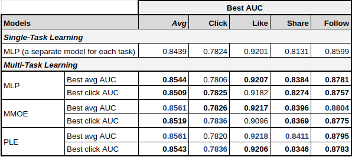

# Benchmark of ranking models
In this document, we describe a benchmark of ranking models available in Merlin [models](https://github.com/NVIDIA-Merlin/models/) library for the TenRec dataset (described [here](./README.md)), which you can use as a reference when deciding the models an hyperparameters you might want to try with your own dataset. We also share the search space used for hyperparameter optimization, that you reuse for your own hyperparameter tuning.
These results are reproduceable by using the TenRec and the quick-start scripts for preprocessing and training. 

## Neural ranking models.
This benchmark includes the following neural architectures for ranking, which are described in the [ranking script](../scripts/ranking/cli_docs.md) and include links to the paper references and to models API docs.

- **Single-Task Learning (STL)**: MLP, Wide&Deep, DeepFM, DLRM, DCN-v2
- **Multi-Task Learning (MTL)**: MLP, MMOE, PLE

## Hyperparameter tuning setup
For a fair comparison of the models, we ran a separate hyperparameter tuning process for each model architecture using TenRec dataset, which we call experiment group. We use the [Weights&Biases Sweeps](https://docs.wandb.ai/guides/sweeps) feature for managing the hypertuning process for each experiment group. The hypertuning uses bayesian optimization (`method=bayes`) to improve the `AUC` metric, which is different for STL and MTL, as explained below.

You can find the [hyperparameter space configurations](../scripts/ranking/hypertuning/) and a [tutorial](./tutorial_with_wb_sweeps.md) on how to use [Weights&Biases Sweeps](https://docs.wandb.ai/guides/sweeps) to run the hyperparameter tuning.

### Single-task learning
For benchmarking the ranking models with single-task learning we used the `click` binary target, as it is the most frequent event in the dataset. 200 trials were performed for each experiment group.

#### Benchmark results
In the following table, you can see the models with the best accuracy (AUC) for predicting the `click` target. You can see the models have a similar level of accuracy, maybe because the dataset contains only 5 basic features (which are presented [here](../ranking/README.md)). But you can notice that models more advanced than MLP can provide better accuracy.

#### Most important hyperparameters

**MLP**

**Wide&Deep**

**DeepFM**

**DLRM**

**DCN-v2**

#### Best runs hyperparameters
TO INCLUDE

### Multi-task learning

For multi-task learning models we use as hypertuning maximization objective the average AUC of the binary targets: `click`,`like`,`share` and `follow`.

We use the following strategy for hypertuning the models:
1. 200 trials optimizing all hyperparameters except the ones that deal with positive class weight and losses weight, to reduce the search space
2. Take the best model hyperparameters from (1) and optimize only positive class weight and losses weight, for 200 trials.

TODO: Describe results

#### Most important hyperparameters

**MLP**

**MMOE**

**PLE**

#### Best runs hyperparameters
TODO

 ### Improvements with hyperparameter tuning
 Analysis on the number of experiments necessary to achieve best accuracy
 - Plot the boxplot per model of the accuracy, to showcase how much it might vary
 - Plot the HPO avg curves over 200 trials for the different models (maybe also keep the dots), to showcase for how many trials HPO should be run