# Benchmark of ranking models
In this document, we describe a hyperparameter tuning benchmark of the ranking models available in in [Merlin Models](https://github.com/NVIDIA-Merlin/models/) library. You can use this benchmark as a reference when deciding the models and hyperparameters you want to explore with your own dataset. 

The experiments used the [Quick-Start for ranking script](../README.md) on the TenRec dataset (described [here](./README.md)). [Weights&Biases Sweeps](https://docs.wandb.ai/guides/sweeps) was used for hyperparameter tuning. 

## Neural ranking models.
This benchmark includes the following neural architectures for ranking, which are described in more detail [here](../README.md). They are divided in two groups of models, which are trained with Single-Task or Multi-Task Learning (MTL).

- **Single-Task Learning (STL)**: MLP, Wide&Deep, DeepFM, DLRM, DCN-v2, training with a single prediction head.
- **Multi-Task Learning (MTL)**: MLP, MMOE, PLE. All these models were built with a separate tower (MLP layers) and a head for each task. While MLP model shares bottom layers, MMOE and PLE are specialized MTL models that uses experts and gates designed to control the weight sharing between tasks. 

## Hyperparameter tuning setup
For a fair comparison of the models, we ran a separate hyperparameter tuning process for each model architecture using TenRec dataset, which we call experiment group.  

We use the [Weights&Biases Sweeps](https://docs.wandb.ai/guides/sweeps) feature for managing the hypertuning process for each experiment group. The hypertuning uses bayesian optimization (`method=bayes`) to improve the `AUC` metric, which is different for STL and MTL, as explained below.

You can check our [tutorial](./tutorial_with_wb_sweeps.md) for more details on how to setup the hypertuning of Quick-start for ranking using W&B Sweeps. 
We share the [hyperparameter space configurations](../scripts/ranking/hypertuning/) we used for this benchmark, so that you can reuse for your own hyperparameter tuning.

## Single-task learning
For benchmarking the ranking models with single-task learning we used the `click` binary target, as it is the most frequent event in the dataset. It was performed 200 trials for each experiment group.

### STL Benchmark results
In Table 1, you can see the models with the best accuracy (AUC) for predicting the `click` target. You can see the models have a similar level of accuracy, maybe because the dataset contains only 5 basic features (which are presented [here](../ranking/README.md)). But you can notice that models more advanced than MLP can provide better accuracy.

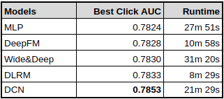 Table 1. Single-task learning ranking models benchmark

### Most important hyperparameters

**MLP**

**Wide&Deep**

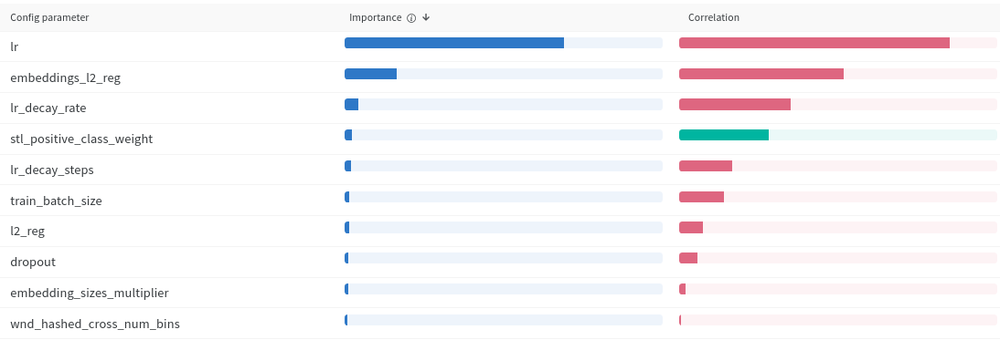

**DeepFM**

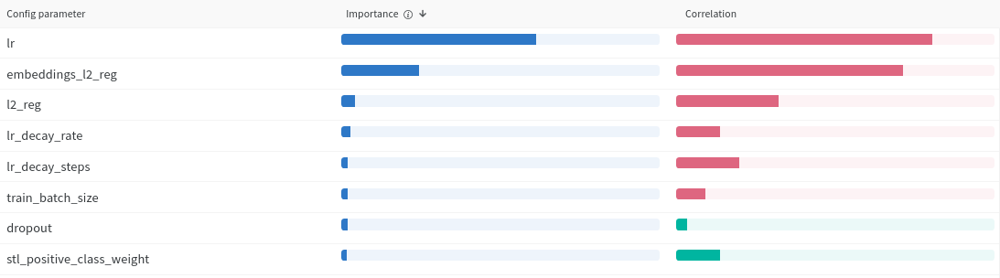

**DLRM**

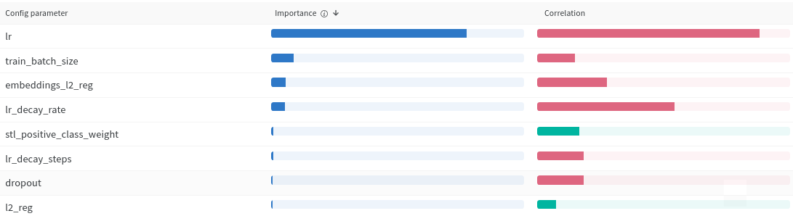

**DCN-v2**

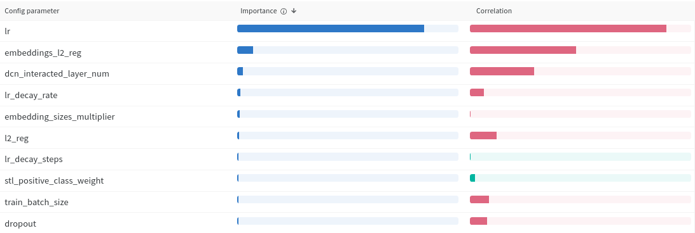

### Best runs hyperparameters
TODO: Include top-5 runs for each experiment group

## Multi-task learning

For hypertuning the multi-task learning models we use as maximization metric the average AUC of the four binary targets: `click`,`like`,`share` and `follow`.

As the search space for MTL models is much larger compared to STL models, we split the hypertuning in two stages, each with 200 trials:

1. We optimize all hyperparameters except the ones that deal with positive class weight and losses weight, to find the best architecture design with equal class and losses weights.
2. We take the best model hyperparameters from (1) and optimize only the hyperparameters that sets positive class weight (`--mtl_pos_class_weight_*`) and losses weight (`--mtl_loss_weight_*`), where `*` is the target name.

### MTL Benchmark results
In this benchmark, we trained baseline MLP models using single-task learning for the four binary targets. The multi-task learning models were trained to predict all binary tasks. The results are reported in Table 2, where `Avg` is the average of the targets.

For each of the MTL models we present two rows with the metrics from the runs with the best **Avg AUC** and the best **Click AUC** (from the Stage 2, as described in previous section). We highlight in <b>bold</b> metrics from MTL models that are better than the baseline STL model and in <b style="color: #2266CC">blue</b> the highest metrics per task.

We can see in general that multi-task learning models can provide better accuracy than single-task learning models, which are optimized for a single task. For example, the hypertuning process found for **MMOE** a run (best **Avg AUC**) whose metrics are all higher than the best individual STL models.

In particular, we can observe that the higher accuracy improvements of MTL models compared to the baseline STL models are for the sparser targets `share` and `follow` (target density is the first line of the table), which makes sense as they can benefit from the other targets training that are denser, i.e., have more positive examples.

When comparing the two runs with the best **Avg AUC** and **Click AUC** for each MTL model, it can be seen that the models with the best **Avg AUC** don't necessarily provide the best **Click AUC**, and that is related to the tasks importance balance governed by the loss weights, which are hypertuned in Stage 2. 

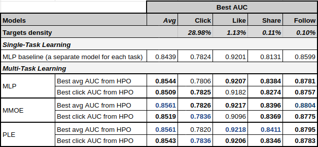
 Table 2. Multi-task learning ranking models benchmark

> Besides the accuracy improvement observed with MTL models compared to STL models, there are also deployment benefits for production pipelines. With MTL you can train, deploy, serve and mantain a single model for multiple tasks instead of many models, leading to simpler pipeline and lower costs.

### Most important hyperparameters

**MLP**

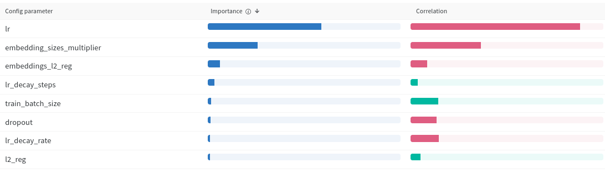

**MMOE**

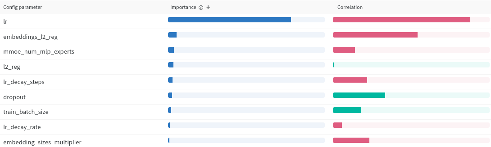

**PLE**

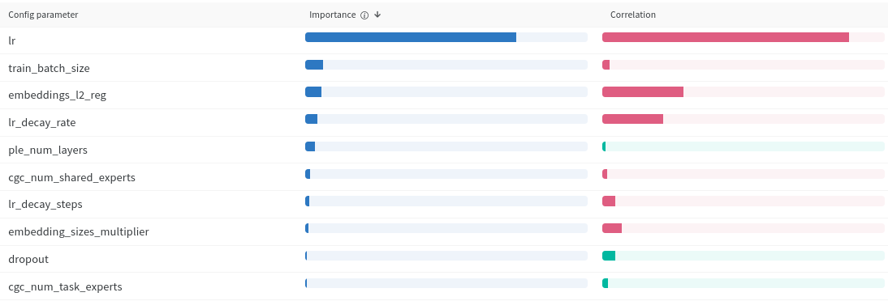

### Best runs hyperparameters
TODO: Include top-5 runs for each experiment group

### Analysis of the hyperparameter tuning process

### Variance of accuracy and its improvement over runs
In the following figure you can see how the accuracy evolves over time during hyperparameter tuning for the DeepFM experiment group, where `y` axis is the AUC and `x` axis the sequence of the trials. It is possible to observe that the bayesian optimization does a good job improving the hyperparameter choices for maximizing the accuracy over time. 

We can also notice the sensitive the model accuracy (AUC) can be due to the hyperparameter choices. For DeepFM case, the accuracy ranged from `0.7023` to `0.7828`. The best run was the trial #180 (`0.7828`), closely followed by the run #105 (`0.7826`). 

>In general, after a given number of trials has explored the search space, the chances of finding a more accurate model diminishes, and that could be taken into account to save some compute budget.

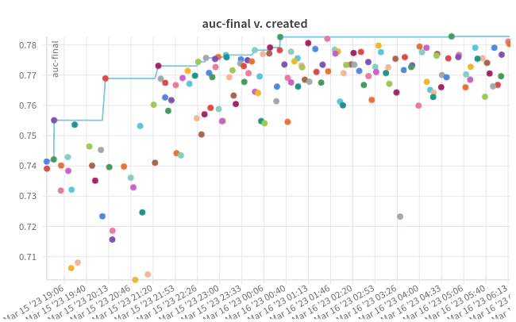

### Refine the search space

This parallel bars chat, also provide by W&B, allows to understand the seach space of the hyperparameters and where are the hot spots for better accuracy (hotter colors). We can notice in next figure summarizing the sweep of DeepFM experiment group that the trials with better accuracy had smaller batch size (16k), smaller learning rate, higher positive class weight, small embedding regularization, small embedding dim with median LR reg and dropout.

You can use this tool to refine your search space for a next hypertuning experiment, either reducing or expanding the search space for individual hyperparameters for better accuracy with lower number of hypertuning trials.

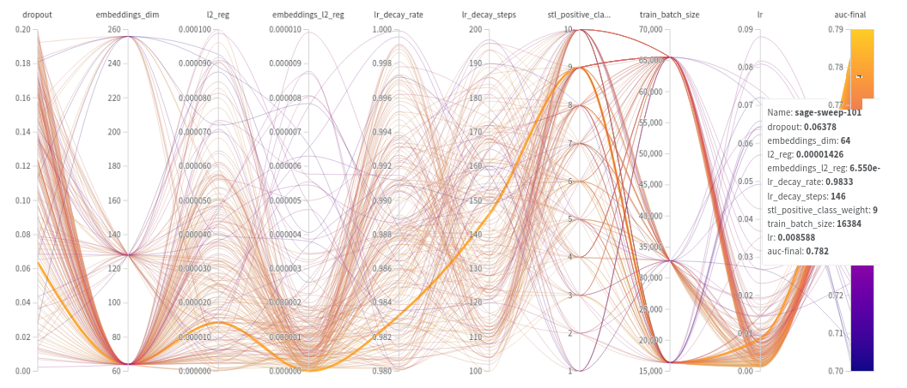

TODO: Include these analyzes
- Plot the boxplot per model of the accuracy, to showcase how much it might vary for different hyperparameters
- Plot the HPO avg curves over 200 trials for the different models (also keep the dots), to showcase for how many trials HPO should be run to achive the better accuracies