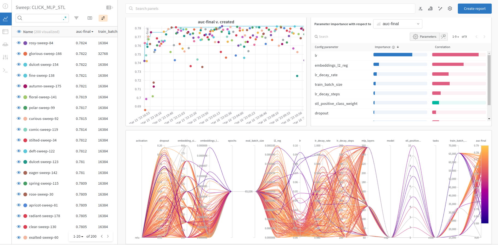

# Hyperparameter tuning with Quick-start and Weights&Biases Sweeps

In machine learning, hyperparameter tuning is the process of adjusting the model or training hyperparameters to get better values for metrics of interest (e.g. accuracy).

The Command Line Interface (CLI) of the Quick-start scripts makes it easy to setup a hyperparameter tuning jobs in Cloud solutions like [Google Vertex AI](https://cloud.google.com/vertex-ai/docs/training/hyperparameter-tuning-overview) and [MS Azure ML](https://learn.microsoft.com/en-us/azure/machine-learning/how-to-tune-hyperparameters?view=azureml-api-2), which can launch distributed hypertuning jobs.

In this tutorial, we demonstrate how to setup a hypertuning process of the `ranking.py` script in a single server/cloud instance using [Weights&Biases Sweeps](https://docs.wandb.ai/guides/sweeps/).

## 1. Creating the Sweeps config file

First, you need to create a sweep configuration file, which defines the hyperparameters to tune, their search space and the metric to be optimized.

Here is an example of the config file for the [ranking.py](../../ranking/ranking.py) script. You will notice that we specify in `program: ranking.py` the script we want to execute, the `method: bayes` for bayesian optimization of the hyperparameters, toward maximizing the `auc-final` metric, which is computed on the evaluation set by the ranking script.  
Then you specify the hyperparameters distribution, which can be `categorical`, `int_uniform`, `uniform`, `log_uniform`, among others. 

The constant parameters that will not vary in the hyperparameter tuning (e.g. `--epochs`, `--train_path`, `--eval_path`) can be provided using a `categorical` distribution with a single value.

You can learn about more about the [W&B sweeps configuration](https://docs.wandb.ai/guides/sweeps/define-sweep-configuration) or about the [ranking.py script](../../ranking/README.md) hyperparameters available in its CLI.

```yaml
program: ranking.py
method: bayes
metric:
  name: auc-final
  goal: maximize
parameters:
  tasks:
    distribution: categorical
    values:
      - "click"
  stl_positive_class_weight:
    distribution: int_uniform
    min: 1
    max: 10
  activation:
    distribution: categorical
    values:
      - relu
  dropout:
    distribution: uniform
    max: 0.2
    min: 0
  embeddings_l2_reg:
    distribution: uniform
    max: 1e-05
    min: 1e-09
  embedding_sizes_multiplier:
    distribution: int_uniform
    max: 8
    min: 2
  l2_reg:
    distribution: uniform
    max: 1e-04
    min: 1e-08
  lr:
    distribution: uniform
    max: 1e-01
    min: 1e-03
  lr_decay_rate:
    distribution: uniform
    max: 1
    min: 0.98
  lr_decay_steps:
    distribution: int_uniform
    max: 200
    min: 100
  mlp_layers:
    distribution: categorical
    values:
      - "64"
      - "128"
      - "256"
      - "64,32"
      - "128,64"
      - "256,128"
      - "128,64,32"
      - "256,128,64"
  model:
    distribution: categorical
    values:
      - mlp
  train_batch_size:
    distribution: categorical
    values:
      - 16384
      - 32768
      - 65536
  eval_batch_size:
    distribution: categorical
    values:
      - 65536
  epochs:
    distribution: categorical
    values:
      - 1
  train_path: 
    distribution: categorical
    values:
      - /preproc_data/train
  eval_path: 
    distribution: categorical
    values:
      - /preproc_data/eval
```

> We provide the [sweep config files](./wandb_sweeps/) from our [hypertuning of ranking models](./README.md) for TenRec dataset. You can use their search space as a basis for setting up your config files for hypertuning ranking models on your own dataset.

## 2. Environment setup

We need to prepare the environment configured for running the Quick-start scripts. The easiest way is to pull and run the Merlin Tensorflow image, as explained [here](../../../ranking/README.md), mapping the folder with the TenRec dataset.

> It assumes that you have already preprocessed the TenRec dataset using `preprocessing.py`, as explained [here](../../../ranking/README.md).

```bash
PREPROC_INPUT_DATA_PATH=/path/to/input/preprocessed/dataset/
OUTPUT_PATH=/path/to/output/path/
docker run --gpus all --rm -it --ipc=host -v $PREPROC_INPUT_DATA_PATH:/preproc_data -v $OUTPUT_PATH:/outputs \
  nvcr.io/nvidia/merlin/merlin-tensorflow:latest /bin/bash
```


### 2.1 Setup wandb client

Inside the container, we need to reinstall **wandb** PyPy package with `pip` so that the `wandb` CLI is properly installed.

```bash
pip uninstall wandb -y
pip install -r /Merlin/examples/quick_start/requirements.txt
```

Then run this command to configure wandb CLI with your Weights&Biases account.
> You will nee a Weights&Biases, that you can create for free at [https://wandb.ai/](https://wandb.ai/).

```bash
wandb init
```

You will be prompted to paste the **W&B API key**, which you can obtain after logging with your account at [https://wandb.ai/authorize](https://wandb.ai/authorize).


```
wandb: Logging into wandb.ai. (Learn how to deploy a W&B server locally: https://wandb.me/wandb-server)
wandb: You can find your API key in your browser here: https://wandb.ai/authorize
wandb: Paste an API key from your profile and hit enter, or press ctrl+c to quit
```

Then it will prompt you with a team name and project name that should be used by default.

That is it, you have setup Weights&Biases inside the Merlin Tensorflow container.

## 3. Testing the environment

Go to the folder with the `ranking.py` and run it with some basic parameters, to test if all requirements are installed correctly and if it runs until the end properly.  

```bash
cd /Merlin/examples/quick_start/scripts/ranking
PREPROC_DATA_PATH=/preproc_data
CUDA_VISIBLE_DEVICES=0 TF_GPU_ALLOCATOR=cuda_malloc_async python ranking.py --train_path $PREPROC_DATA_PATH/train --eval_path $PREPROC_DATA_PATH/eval --output_path ./outputs/ --tasks=click --stl_positive_class_weight 3 --model dlrm --embeddings_dim 64 --l2_reg 1e-2 --embeddings_l2_reg 1e-6 --dropout 0.05 --mlp_layers 64,32  --lr 1e-4 --lr_decay_rate 0.99 --lr_decay_steps 100 --train_batch_size 65536 --eval_batch_size 65536 --epochs 1 --train_steps_per_epoch 10 --log_to_wandb
```

The above command includes `--log_to_wandb`, that enables logging with Weights&Biases. You can also configure the W&B team (`--wandb_entity`) and project (`--wandb_project`) to create the run.

During the execution, W&B will log your execution and provide a run URL, that allows tracking metrics over time.

After that, the `ranking.py` script should finish sucessfully until the end, to ensure if you have your environment ready for starting the hypertuning.


## 4. Creating the Sweep at Weights&Biases 

You need to create a Sweep at Weights&Biases, that will manage the hypertuning process. You can either create it at [https://wandb.ai/](https://wandb.ai/) website, or via `wandb` CLI like in this example, where we use one of our existing sweep config files.

```bash
wandb sweep --name <SWEEP_NAME> /Merlin/examples/quick_start/scripts/ranking/hypertuning/wandb_sweeps/stl_mlp/stl_click_mlp.yaml
```

That command will print the link to the Sweep interface at https://wandb.ai/ and an example of the command to start the hypertuning: `wandb agent`

```
wandb: Created sweep with ID: <SWEEP_ID>
wandb: View sweep at: https://wandb.ai/<TEAM_NAME>/<PROJECT_NAME>/sweeps/<SWEEP_ID>
wandb: Run sweep agent with: wandb agent <TEAM_NAME>/<PROJECT_NAME>/sweeps/<SWEEP_ID>
```


## 5. Starting the hypertuning process

It is time to use `wandb agent` to start the hypertuning process using the full sweep identification obtained in the previous command: `<TEAM_NAME>/<PROJECT_NAME>/sweeps/<SWEEP_ID>`. 

It allows configuring the number of trials for hypertuning with `--count`, which will be run sequentially. If you want to make the hypertuning faster, you might start multiple `wandb agent` process in parallel using the same sweep id (each with their own `--count`), so they share information during the hypertuning. In this case, you need to set a separate GPU for each process with `CUDA_VISIBLE_DEVICES` env variable. 

You can make `wandb agent` to run in background with `nohup` and save its messages to a file with `&>`. Here is an example command:

```bash
CUDA_VISIBLE_DEVICES=0 TF_GPU_ALLOCATOR=cuda_malloc_async nohup wandb agent --count 100 <TEAM_NAME>/<PROJECT_NAME>/sweeps/<SWEEP_ID> &> \tmp\nohup0.out &
```

That is it! You can now let hypertuning work improving your model accuracy while you go for other activities! 

## 5. Monitoring the hypertuning process & analysing results

You can track the hypertuning process by checking the W&B Sweep URL provided when you created it. As show in below image, Weights&Biases provides a nice interface to explore the Sweep results. It lists all the runs, which you can sort by your optimization metric (`auc-final` in this case). 

That interface also provides out-of-the-box charts showing how runs accuracy evolved over time, the most important hyperparameters with respect to the optimization metric and a parallel bars chart across the hparams plot colored by the accuracy, to better visualize the search space ranges that provide the better accuracy.

<center>

</center>

For more information on how to manage the sweep, please refer to [Weights&Biases Sweeps docs](https://docs.wandb.ai/guides/sweeps/).